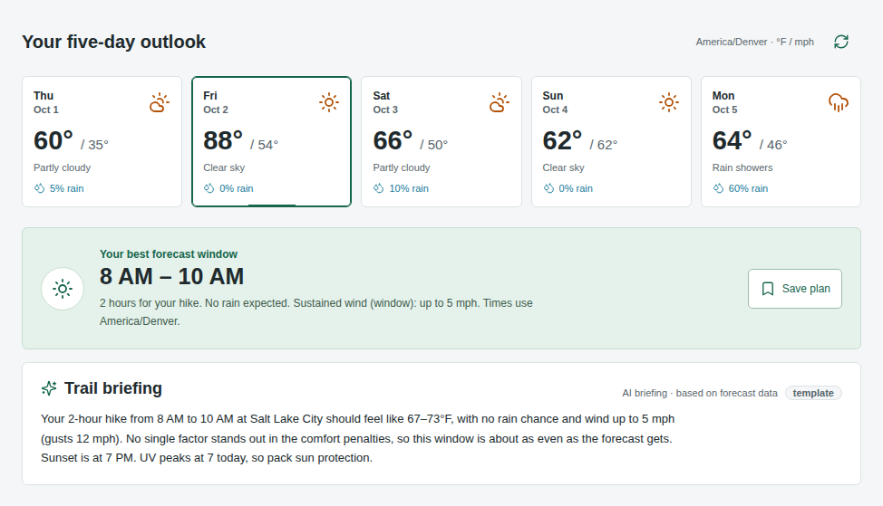
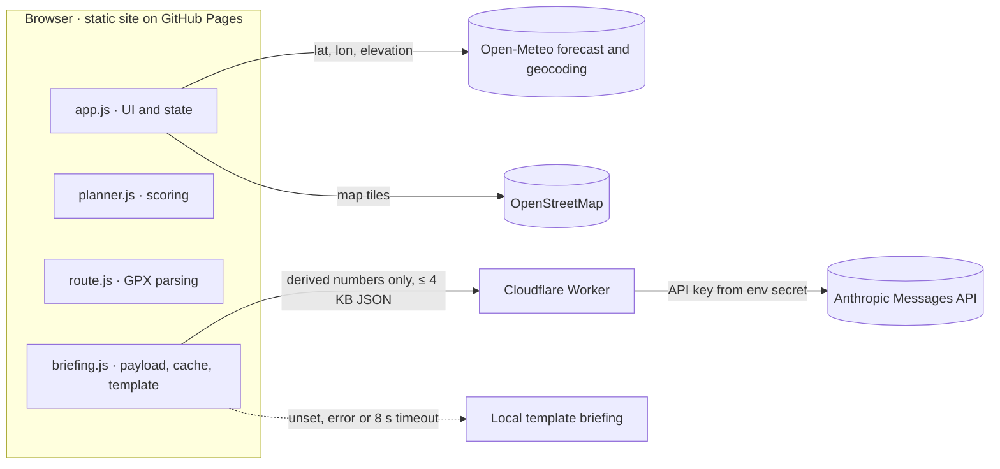

# Trail Window

**Pick a place and an activity, and Trail Window finds the most comfortable hours in the next five days to be outside.**

**[Live demo → sanjeldarshan65-afk.github.io/trail-window](https://sanjeldarshan65-afk.github.io/trail-window/)**



It's a static site with no build step and no account. It uses Leaflet, OpenStreetMap and Open-Meteo, plus an optional Cloudflare Worker for the AI briefing.

## Features

- **Window scoring.** Ranks every complete daylight window of 1–5 hours by rain, wind and feels-like penalties, and shows the math: a per-component penalty table, alternative windows, and honest tie notes.
- **GPX import and elevation.** Parses a GPX file in the browser and reports distance and ascent. You can forecast at the start, high point or finish, at that point's elevation. You can also click the map or enter coordinates and elevation by hand.
- **Adaptive packing list.** Items appear because of the forecast: a warm layer for low feels-like, sun protection for UV, extra water for heat, a windproof layer for gusts, a shell for rain. Each forecast-driven item says why in parentheses.
- **AI trail briefing.** A 2–3 sentence summary of the chosen window that names its main tradeoff, such as a cold start, afternoon heat or gusts on exposed terrain. It uses only the forecast numbers. If the AI is unavailable, a local template writes the briefing, so the card is never blank.
- Personal rain and gust limits, saved plans, a persistent checklist, plan download, an hourly chart with a numeric table, keyboard and screen-reader support, and layouts from 390px phones up.

## How scoring works

The scoring lives in [`planner.js`](planner.js). For each hour, with apparent temperature `feels` in °F, wind in mph and `rain` as precipitation probability in %:

```text
rain        = rain × 0.7
wind        = max(0, wind − 10) × 1.4
            + max(0, gust − 20) × 1.0
            + [ride only] max(0, wind − 12) × 1.2
temperature = max(0, 42 − feels) × 1.2
            + max(0, feels − 75) × 1.5
            + [run only]  max(0, feels − 75) × 1.3
```

A window's score is the **average** of each component over its hours, summed. Lower is better. Above 35, the card says "Mixed conditions · plan carefully".

**Example:** one hiking hour at 40°F feels-like, 15 mph wind, 25 mph gusts and a 20% rain chance scores 14 (rain) + 7 + 5 (wind) + 2.4 (temperature) = **28.4**.

**Hard filters run before scoring.** A window is skipped if any of these hold:

- It isn't a run of consecutive hours.
- It starts in the past or before sunrise.
- It starts before 6 AM or ends after 8 PM.
- It ends less than 30 minutes before sunset.
- Any hour has a thunderstorm code (≥ 95) or missing data.
- Any hour exceeds your rain limit (default 50%) or gust limit (default 30 mph).

Times use the destination's timezone, not the browser's.

**Ties:** scores within 1e-9 of each other count as equal, and the earlier start wins. The interface says so, for example "Two windows tie on comfort penalties; the earliest complete window wins."

**Why these are comfort preferences, not safety probabilities:** the thresholds (42–75°F, 10 mph wind, 20 mph gusts) and weights describe how pleasant a few hours outside usually feel. They aren't calibrated against injury or incident data, and a low score doesn't mean a window is safe. Terrain, lightning outside the forecast grid, avalanche hazard, closures and route exposure are not modeled. The AI briefing explains this deterministic score; it doesn't change the score or the ranking.

## Architecture



| File                                 | Role                                                                                     |
| ------------------------------------ | ---------------------------------------------------------------------------------------- |
| `index.html`, `styles.css`, `app.js` | Interface, state, Open-Meteo calls, map, checklist and saved plan                        |
| `planner.js`                         | `rankWindows`, `findWindow`, `tieNote`; runs in browser and Node                         |
| `route.js`                           | GPX validation and parsing                                                               |
| `briefing.js`                        | `BRIEFING_URL` config, payload allowlist, 8 s timeout, per-plan cache, template fallback |
| [`worker/`](worker/README.md)        | Cloudflare Worker that calls Anthropic (`claude-haiku-4-5` by default, `max_tokens` 250) |
| `vendor/`                            | Vendored Leaflet, Chart.js and Lucide; no CDN scripts                                    |

## Privacy and security

- **GPX never leaves the browser.** Files are parsed locally. Only the selected forecast point's coordinates and elevation go to Open-Meteo. Map tiles reveal the viewed area to OpenStreetMap. The app never asks for device location.
- **The AI sees only derived numbers.** The briefing payload is a fixed allowlist: location name, activity, duration, window times, feels-like range, max rain %, wind and gusts, UV, sunset, elevation and up to three penalty rows. It contains no coordinates, GPX or free text.
- **The API key is server-side only.** It is a Cloudflare secret (`wrangler secret put`), read as `env.ANTHROPIC_API_KEY`. It isn't in the frontend, the repo or git history.
- **The Worker is locked down.**
  - CORS allows only the GitHub Pages origin and localhost.
  - Bodies over 4 KB are rejected while streaming.
  - Unknown fields, wrong types and out-of-range values get a `400`.
  - Rate limit: 10 requests per minute per IP (in memory, best-effort per isolate).
  - Responses are generic JSON errors that never include upstream details.
  - The system prompt forbids invented hazards and safety guarantees and treats every input value as data.
- **Briefings are cached per plan in memory**: location, day, activity, duration and chosen window. Switching tabs doesn't call the Worker again.

## Run it locally

```sh
python3 -m http.server 8000         # then open http://localhost:8000
npm ci && npm test                  # scoring, GPX and briefing unit tests
npm run check:responsive            # Playwright at 390/768/1280px, screenshots in screenshots/
cd worker && npm install && npm test  # Worker validation, CORS, rate limit and contract tests
```

`check:responsive` stubs Open-Meteo and the map tiles with a fixture, so it runs offline and gives the same result every time. It fails on horizontal page scroll, console errors, tap targets under 44px at 390px, or a broken briefing fallback.

Without a Worker, the briefing card shows the template version with a small "template" badge.

## Deploy the AI briefing

```sh
npm i -g wrangler
cd worker && npm install
wrangler login
wrangler secret put ANTHROPIC_API_KEY
wrangler deploy
```

Paste the printed `*.workers.dev` URL into `BRIEFING_URL` at the top of [`briefing.js`](briefing.js), then push. [`worker/README.md`](worker/README.md) covers local development and the request schema.

## Data notes

The Brighton and Trial Lake presets use approximate forecast points and elevations from USDA SNOTEL metadata for [Brighton](https://wcc.sc.egov.usda.gov/nwcc/site?sitenum=366&state=ut) and [Trial Lake](https://wcc.sc.egov.usda.gov/nwcc/site?sitenum=828). They request modeled weather, not station observations.

UV categories follow the [EPA scale](https://www.epa.gov/sunsafety/uv-index-scale-0). GPX ascent is summed from raw elevation differences, so it includes GPS noise. The bundled sample route is illustrative and is not a navigation route.

## What I'd build next

- **Wasatch hazard feeds.** Show the Utah Avalanche Center danger rating and AirNow AQI for the selected point and day, and let a bad rating or AQI rule a window out, the same way thunderstorms do now.
- **Segment-level route forecasts.** Split a GPX route by estimated pace, so each part of the outing is scored with the forecast for that place and that hour. A ridge at 1 PM can differ a lot from the trailhead at 8 AM.
- **Saved plans synced across devices.** Store plans and checklists behind a passkey login, add a shareable read-only plan link, and send an alert if the chosen window's forecast changes overnight.
- **Personal comfort calibration.** Let users rate finished outings, then fit their own thresholds. Someone who runs warm could shift the 42–75°F band, and the briefing would explain the change.
